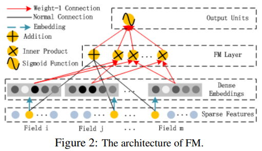

## mab-thompson
* 기본적인 user action 기반 sampling - recommend(rank 등)
* 간단하면서도 꽤나 유용
* log 수집 환경 내에서 update는 필요없긴 하다.

## RRF
Reciprocal rank fusion
* 다양한 ranking model output을 조합하는데에 유용한 듯.
* stat_base, model_base ranker를 모두 agg할 수 있겠다.
* 각 모형의 output을 input으로 넣는 형태로 생각했다.

## item2vec
* feature embedding 기초 모듈 생성을 위해 작성
* item, user representation으로 나아갈 수 있을 듯
#### 문제점
* cold start
    * deepFM 계열 등 stat value를 함께 활용하여 warm-up 가능
        * from https://arxiv.org/abs/1703.04247
    * 유사 item 들의 평균 등 pooling을 활용해 initializing 가능
        * from https://medium.com/airbnb-engineering/improving-deep-learning-for-ranking-stays-at-airbnb-959097638bde

## Factorization Machine
* deepFM을 위한 모듈. 이것만 써도 되긴 되겠다

## local test

#### thompson simulation
python recommend/thompson_simulation.py